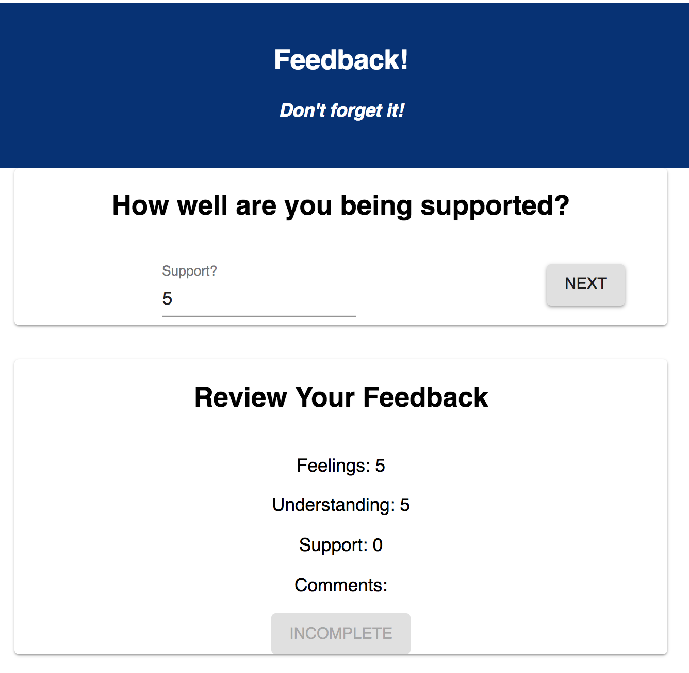

# Redux Feedback Loop
    This Feedback Loop Project will allow the user to do their daily feedback about their day.Feedback will be collected over 4 views, and when all steps are complete, your app will save the feedback in the database. In a separate part of the page, display the current feedback values and a submit button. 

### Build With
   This project is build with React, Redux, Javascript, CSS, HTML, Express, Nodejs and MaterialUI.

### GETTING STARTED

```
npm install
npm run server
```

Now that the server is running, open a new terminal tab with `cmd + t` and start the react client app.

```
npm run client
```

### ADD NEW FEEDBACK


Create a multi-part form that allows users to leave feedback for today. 
There will be 4 views for the form parts.
The parts:
- How are you feeling today?

- How well are you understanding the content?

- How well are you being supported?

- Any comments you want to leave?


While there is no nav bar, each part of the form should be at its own route. Clicking next should move the user to the appropriate step in the process as well as update the `Review` Component.


## THE REVIEW COMPONENT

In addition to the multi-step form, the app will display the results of each step clearly and at all times.

### Incomplete, Submit button is disabled:


### Survey complete, Submit button is active:


## SUBMIT THE FEEDBACK

The `Review` portion needs a submit button which will be clicked on to actually submit the completed feedback to the server. **This submit button should only be active when all of the survey steps are complete.**

When the submit button is clicked, save the submission in the database. The user should see a submission success page.


